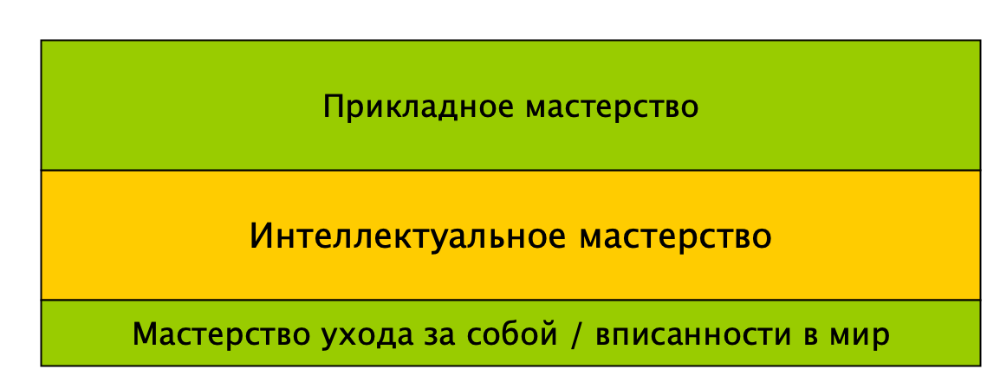

[Основные понятия:]{.underline} системные уровни в жизни, стек
дисциплин/предметов, стек мастерств, общий интеллект/интеллектуальное
мастерство, критерий наличия мастерства

**Системные уровни в организации жизни**

В эволюционной биологии было введено понятие «системных уровней», чтобы
объяснить разницу в устройстве и демонстрируемом поведении, например,
бактерий, кошек и людей. В самом общем виде можем выделить следующие
системные уровни^[Подраздел «Мышление об агентах (людях
и AI): прежде всего они исполнители ролей», раздел 5
«Методы/функции/практики/деятельности/культуры/методы работы и роли» в
курсе «Системное мышление»]:

-   **Вещества**. На этом уровне говорим об атомах и молекулах, из
    которых состоят вещества, об их превращениях. Люди создают методы
    создания веществ, например, таблеток для горла, создают простые
    системы без сложного управления и сложных вычислений для создания и
    управления. Мыло или таблетку, пакет создают и отдают пользователям,
    они не содержат в себе контроллеры и достаточно просты по своему
    устройству;
-   **Киберфизические системы**, например, часы, электростанции, ракеты.
    На этом уровне говорят о том, как создать системы, которым требуется
    непростое управление с постоянным контролем состояния системы и ее
    элементов. Например, умные часы будут отслеживать ваш сон благодаря
    встроенным контроллерам, а также будут следить за своим зарядом -- и
    сообщат владельцу, что пора бы их зарядить. Атомные электростанции
    создаются и эксплуатируются коллективами разных предприятий,
    передают энергию пользователям и сообщают, благодаря контроллерам, о
    своем состоянии;
-   **Живые существа/формы жизни**, например, растения, животные, люди.
    Здесь нас интересует именно зарождение/появление форм жизни и их
    развитие. Также, если мы говорим о человеке на этом уровне, то нас
    интересует состояние его тела (а не его личность/душа).
-   **Личность/агент**, то есть такая форма жизни, которая деятельно и
    целенаправленно меняет мир под себя. Личностями обычно принято
    считать людей, но в последние годы нужно говорить уже и о «разумных
    роботах», обладающих общим интеллектом/general intelligence. И тех,
    и других надо обучать совместной деятельности и жизни в обществе.
-   **Организация,** которая работает благодаря **коллективу из
    личностей/агентов**. Коллективные формы работы позволяют достичь
    результатов, которые позволяют улучшить качество жизни агентов и
    принципиально не достижимы одной личностью, например, построить
    город, обеспечить его безопасность, содержать улицы в чистоте.
-   **Сообщество**, которое включает себя различные коллективы.
    Например, можно говорить о «сообществе гитаристов», «сообществе
    менеджеров» и целых организаций, которые заинтересованы в том, чтобы
    оказывать им услуги. Сообщества обычно объединяются вокруг каких-то
    общих интересов и общих методов/практик работы с ними («игра на
    гитаре» и «методы игры на гитаре», «организация» и «управление
    организацией/менеджмент»).
-   **Общество**, которые мы обычно выделяем по признаку принадлежности
    к определенной стране («российское общество», «американское
    общество») или иному политико-географическому образованию («общества
    Востока»). Выделение этого уровня позволяет нам обсуждать разницу в
    способах организации коллективной жизни в разных странах -- и даже
    разницу в принимаемых в обществе и обществом решениях. Например,
    если вы создаете ПО для беспилотного автомобиля, которому предстоит
    принимать, кого спасать в случае аварии и невозможности избежать
    жертв, то вы должны знать и о том, какой выбор будет сочтен
    приемлемым в обществе, в котором будут пользоваться этим
    автомобилем^[<https://www.moralmachine.net/>].
    Например, в условно «западных» сообществах чаще выбирался
    «утилитарный», «чисто математический» вариант «спасти побольше
    людей» (и не важно, насколько они виноваты в создании аварийной
    ситуации), а в условных «восточных» чаще предпочитали спасать
    пассажиров и законопослушных
    пешеходов^[<https://www.media.mit.edu/projects/moral-machine/publications/>].
-   **Антропосфера**, включающая в себя человечество и его среду
    обитания (природную и создаваемую). На этом уровне люди иногда
    объединяются для решения проблем, но довольно редко и не всегда
    удачно.
-   **Вселенная со всеми встречающимися в ней формами жизни**, даже
    теми, о которых нам ничего не известно («инопланетные цивилизации»).
    Здесь стремимся исследовать космос и провести проекты космических
    изменений. Возможно, ближайший космос уже стоит включать в
    «антропосферный» уровень, так как человечество его активно
    осваивает, но «дальний» на этом уровне.
-   (потенциально) **возможный уровень над Вселенной («класс
    Вселенных»).** Его существование пока лишь предполагается в качестве
    одной из научных гипотез, но ни подтвердить, ни опровергнуть её мы
    пока не можем.

Как вы могли заметить, уровни выделены достаточно грубо. Например, на
уровне «вещества» не разделены «молекулы» и составляющие одну молекулу
«атомы», а уровни ниже атомного (протоны и нейтроны, кварки) вообще не
упоминаются. Почему так? Потому что в данном случае нам надо дать самое
общее («деконцентрированное») описание типовых системных уровней в
жизни. Если перечислять все возможные уровни, то не хватит и целого
учебника -- а еще мы почти наверняка что-то упустим! Потому что везде,
куда бы вы ни посмотрели, вы можете найти какие-то уровни, которые вас
(в некоторой роли) будут интересовать с какой-то целью. Например, если
вы биолог, то вас может интересовать примерно такая нарезка уровней:

А если вы медик, то вы почти наверняка выделите уровень «тканей» между
«органом» и «клеткой», потому что органы состоят из тканей, и уровень
«системы органов» (например, пищеварительная система) между «органом» и
«организмом». Потому что медику/врачу может потребоваться лечить
заболевания пищеварительной системы или дисплазию соединительной ткани!

То есть, в реальной жизни уровни выделяются *вниманием* с какой-то
*целью*, и нарезка по уровням не «универсальна», а «контекстозависима».
И если у вас нет цели сделать новое открытие в теоретической физике, вы
не разрабатываете технологии замкнутого ядерного
цикла^[<https://ria.ru/20221121/reaktory-1832434122.html>],
то есть методы более эффективного извлечения энергии из уранового
топлива^[<https://habr.com/ru/companies/leader-id/articles/520580/>],
то вас вряд ли интересует уровень ниже «атомного». Точно так же вас не
будут интересовать подробности устройства человеческого организма, если
вы не лечите и не изобретаете новые методы лечения людей. В этом случае
вам не нужно держать в голове или экзокортексе массу подробностей насчет
того, что и как нужно делать. Достаточно того, что называют «общей
эрудицией»: знать, что есть уровень «вещества» или «живого существа» --
и дальше, если вам нужно, вы можете приблизить / zoom in /
сконцентрироваться на этом уровне и «раскрыть» его, выделив более мелкие
уровни при необходимости. Тому, как проводить такие операции, учат на
курсе «Рациональная работа».

**Стек дисциплин/предметов и интеллект-стек** **мастерств**

Как вы уже могли заметить, каждый системный уровень может описываться
целым набором дисциплин/предметов. Наиболее фундаментальные из них,
например, физика, биология, математика, описывают наиболее общие
закономерности и правила выполнения операций, которыми мы пользуемся
ежедневно. Ежедневно нам нужно что-то рассчитать, например, бюджет на
работе или дома, стоимость продуктовой корзины в супермаркете. Ежедневно
мы, люди, хотим того или нет, подчиняемся физическим законам/принципам
(потому что мы не только личности или живые существа, но еще и
физические объекты). Ежедневно наши тела и наша личность
меняется/эволюционирует, подчиняясь в этом законам биологии, даже если
мы того не замечаем или отказываемся признаваться.

Дисциплины/предметы будут различаться по шкале от «наиболее
фундаментальных» к «наиболее прикладным». При этом вам как личности
нужно будет освоить с разной степенью глубины эти дисциплины, получив на
выходе интеллектуальное мастерство.

Конкретные методы расчета бюджета вашего подразделения, которые вы
будете применять в вашей компании, очень «прикладные», принадлежат к
«методам работы вашего предприятия» и описываются обычно в учебниках по
финансовой инженерии предприятия (бухучет, управленческий учет, и так
далее). При этом само применение этих методов для вас возможно, если вы
понимаете, почему учет бюджета важен для компании (такие знания даются в
дисциплине менеджмента/управления предприятием), понимаете, как будут
оцениваться ваши результаты на работе, если вы этого не сделаете
(рациональность), владеете математикой, умеете довести задачу до конца
(собранность). То есть, даже очень прикладное мастерство в расчете
бюджета имеет пререквизиты, которые нужно освоить, чтобы его получить.

**Уровень «личность»**

Чтобы мы не были совсем неграмотными и могли как-то ориентироваться в
мире, в школе и университете мы изучаем дисциплины/предметы, чтобы у нас
как личностей сформировалось жизненное мастерство, точнее, его часть --
*общий интеллект/интеллектуальное или мыслительное мастерство/general*
*intelligence*, благодаря которому мы сможем ориентироваться в жизни,
быстро извлечь и применить имеющиеся знания, быстро переобучиться
новому. Наличие отличного прикладного мастерства не спасет вас, если
случится технологический «подрыв» в вашей области. В 1910 году человек
мог быть отличным кучером, знающим мельчайшие нюансы управления
лошадьми, но пришли автомобили -- и они потеряли работу, были вынуждены
переобучаться. Общее ускорение жизни приводит к тому, что переобучаться
нужно постоянно. Вчера бухгалтер мог отлично вести бухгалтерские книги
вручную -- но теперь ему нужно знать 1С или альтернативную программу для
бухучета. Вчера можно было полагаться только на свой мозг -- но теперь
человек, который это делает, проиграет усиленному экзокортексом
человеку. Именно интеллектуальное мастерство дает нам возможность прийти
в новую сферу, быстро разобраться, чему учиться, и выстроить
образовательную траекторию.

Конечно же, отдельно выделяем набор прикладных мастерств, благодаря
которым можно непосредственно получить результат в конкретной предметной
области. Вы или ваша организация смогли вырастить дерево, и не абы
какое, а то, которое в данной местности раньше не росло, и с красиво
отформатированной кроной? Вы почти наверняка применяли знания по
растениеводству. Довезли себя и пассажиров? Вы/беспилотное авто
применяли методы/практики вождения автомобиля.

Также есть еще мастерство ухода за собой, которое включает самые базовые
знания о «техобслуживании» организма. Наличие этого мастерства дает
возможность максимально плодотворно применить интеллектуальное и
прикладное мастерство^[Подраздел «Чему учит курс
«Системное мышление»: онтология» раздела 1 «О мышлении» курса «Системное
мышление»]. Далее оно будет чуть подробнее раскрыто.

С точки зрения эволюционной биологии можно сказать, что интеллектуальное
мастерство выполняет роль «генов», которые в организме отвечают за
сохранение и передачу информации и содержат в себе некоторое
«информационное ядро», накладывающее ограничение на проявление признаков
у потомков. Интеллектуальное мастерство определяет нашу способность
разобраться в новой предметной области, в новом проекте, и накладывает
ограничения на скорость освоения этой области. Слабое интеллектуальное
мастерство не позволит разобраться быстро (а ведь скорость -- одна из
важнейших характеристик для успешной эволюции живого существа!).
Потребуется долго, методом проб и ошибок, нащупывать
принципы/закономерности, которые действуют в новой предметной области, а
до того искать «лайфхаки» в каждом конкретном частном случае. Например,
вы можете долго не обращать внимания на то, что важные объекты внимания
в вашей предметной области не выделены, в вашем коллективе не хватает
обладающих нужным мастерством людей. В компании никто не выполняет роль
архитектора организации, архитектура компании становится «узким местом».
Но увидеть этого нельзя, потому что нет понимания, что в дисциплине
«менеджмент» можно подсмотреть важные объекты, наличие внимания к
которым в вашем проекте лучше бы проверить -- а иногда вообще нет
понимания, что НУЖНО выделять объекты внимания, и знаний, КАК это
делать. «Расшить» узкое место становится невозможным, ведь оно
«невидимо». И либо компании как-то *повезет* интуитивно нащупать методом
проб и ошибок «костыль», который позволит хромать (не бежать) дальше,
либо придет кто-то обладающий интеллектуальным мастерством и/или
прикладник, который такие проблемы «сто раз видел», либо она рано или
поздно из-за ряда накопленных проблем перестанет существовать.

Прикладное мастерство выполняет роль «фенов», то есть конкретных
наследственных признаков у конкретной особи, и обеспечивает
непосредственную адаптацию к среде: наше умение вписаться в конкретную
среду и получить результат «в нужном месте, в нужный час (и в нужной
роли)». Вы приходите на танцевальную вечеринку и применяете ваше
танцевальное мастерство -- возможно, что в каком-то конкретном стиле
танца (например, кизомба). Вы рассчитываете бюджет подразделения и на
выходе получаете результат -- рабочий продукт/артефакт, который можно
передать дальше и которым можно воспользоваться без вашего личного
участия.

И наконец, мастерство ухода за собой обеспечивает возможность
воспользоваться вашим интеллектуальным и/или прикладным мастерством,
буквально создает условия для их проявления. В чем это проявляется,
поговорим далее.
