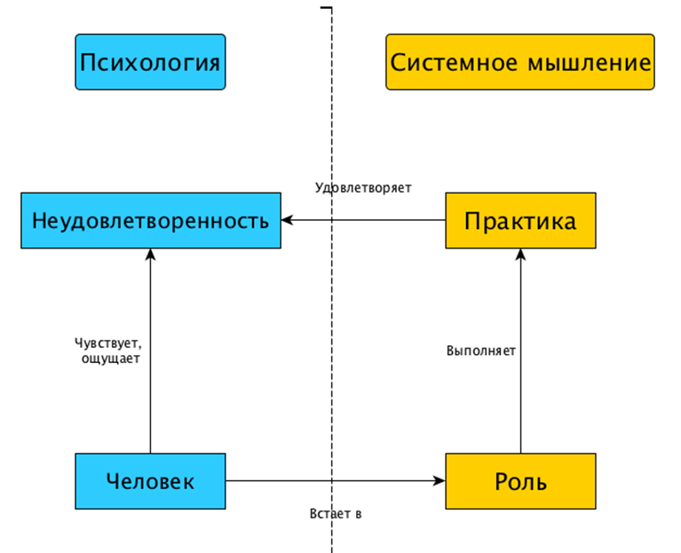
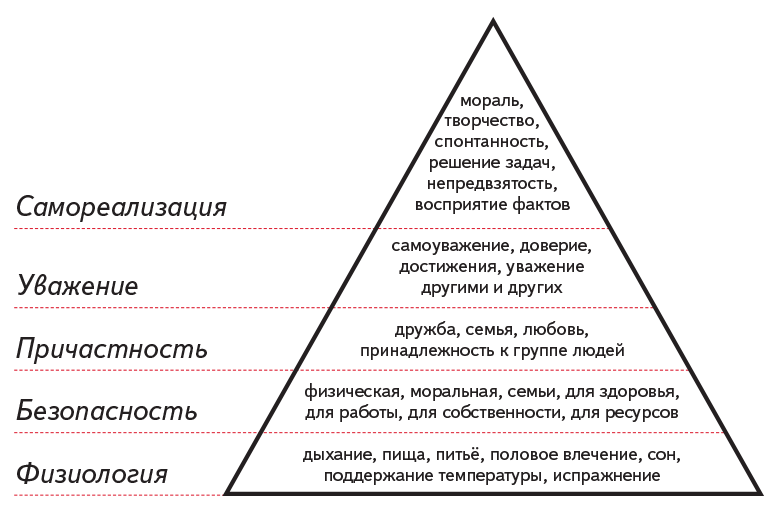
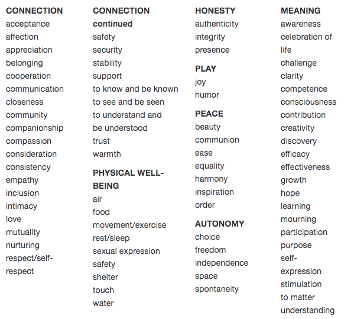
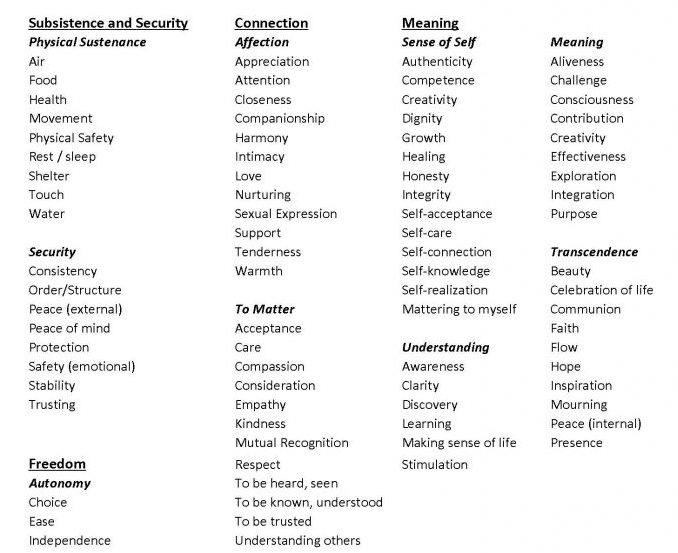
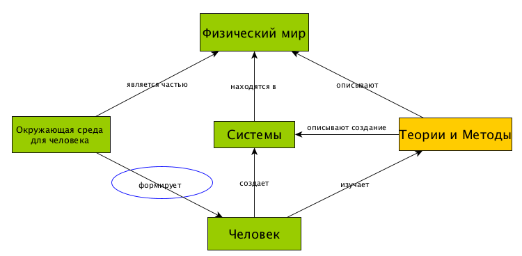

[Основные понятия:]{.underline} мотивация, принцип свободы воли,
неудовлетворенность, личные интересы, обстоятельства как причина
действий, таланты, ограничения, ценность, пропитка

**Что такое мотивация**

Чтобы изменить мир, нужно встать в роль и выполнить соответствующие роли
действия/методы/практики, которые выбираются рационально (интеллектом).
Но прежде чем встать в роль, ее нужно выбрать, а затем уговорить себя
эту роль выполнить, то есть, поработать с психологической частью
личности. За знание, какие роли бывают в проектах, отвечает ролевое
мастерство и деятельностный / трудовой кругозор, за умение осознанно
выбирать роли и играть их -- мастерство стратегирования, за уговаривание
себя -- психопрактическое мастерство.

**Мотивация** -- уговаривание себя встать в роль и исполнить ролевые
практики бесперебойно, без отвлечений, на выбранном уровне внимания.
Мастерство мотивации или самолидерства позволяет оценить, как часто и
как быстро удается уговорить себя сделать то, что важно, а не то, что
легко^[Принцип «делать то, что важно, а не то, что
легко» кажется очевидным, но, к сожалению, часто не исполняется как в
жизни отдельно взятого человека, так и в рабочем
проекте.].

Иногда уговорить себя встать в какую-то роль легко. Например, часто
легко исполнить роль «отдыхающего» и поскроллить ленту новостей в
соцсетях на уровне момента. Зато может быть сложно встать в роль
«ученика» или «студента» для изучения данного курса на уровне изменения
образа жизни.

Если в роль получается встать легко, то практики мотивации не нужны. Но
как только появляются проблемы, должен сработать психический
переключатель (осознание), переключиться в режим S2. После чего сознание
должно перевести камеры внимания на проблему, которая мешает встать в
роль, выделить ее из фона, приблизить при помощи зума и начать
распознавать. Если проблема, мешающая встать в роль, распознана и
названа правильно, то ее можно решить: встать в какую-то другую,
«вспомогательную» роль и выполнить соответствующую практику, после чего
вернуться к нужной роли и уже исполнить ее бесперебойно. Например,
исполнению роли ученика на данном курсе может помешать усталость. Тогда
надо встать в роль отдыхающего и восполнить свои телесные и умственные
ресурсы, после чего можно будет вернуться к изучению курса.

**Чтобы уговорить себя исполнить роль, нужно знание себя: своих
неудовлетворенностей, личных интересов, сильных и слабых сторон
(талантов и ограничений), ценностей. Именно они либо помогают, либо
мешают выполнить практики. Дальше с учетом имеющегося знания нужно будет
провести «пропитку» себя, создать подходящие условия для появления
мотивации, а кое-где, возможно, и заставить себя начать что-то делать --
до тех пор, пока вы не встанете в выбранную вами
роль**^[В какую-то роль, которая позволяет избавиться от
неудовлетворенности, вы рано или поздно встанете: сами (из-за
неудовлетворенностей, личных интересов) или вас вынудят
обстоятельства.]. Все это вместе составляет мастерство
мотивации / самолидерства.

Мотивация возможна только в отношении себя, поскольку каждый человек
имеет доступ только к своему сознанию и не может просто так, без
посредников, заглянуть в голову к другому^[Understanding
Motivation and Emotion, Johnmarshall Reeve].
«Мотивировать кого-то» невозможно; можно только устроить другому
человеку «пропитку» новыми картинами мира и создать условия, в которых
он будет готов встать в роль и выполнить практику согласно новым
картинам^[В проекте роль, исполнитель которой всем этим
занимается, называется лидер. В главе 7 показано, что лидерство является
подпрактикой менеджмента.]. При этом у другого все равно
остается право и возможность отказаться от исполнения желаемой вами
роли^[В проекте роль, исполнитель которой всем этим
занимается, называется лидер. В главе 10 показано, что лидерство
является подпрактикой менеджмента]. Этот принцип
называется **принципом свободы воли**.

**Неудовлетворенности как причина действий**

Психологи предлагают разные объяснения, почему человек встает в роль и
начинает действовать. Ключевыми для нас являются следующие три:

-   неудовлетворенности или психологические потребности;
-   личные интересы;
-   обстоятельства.

Самым популярным и удобным объяснением причин, почему люди начинают
что-то делать, оказалась концепция «психологических потребностей».
Психологическими потребностями называют ощущения недостатка или нужды в
чем-либо, а также условия, необходимые для роста и развития. Всем
известна, вероятно, пирамида Маслоу, которая делит потребности на 5
типов:

Концепция потребностей оказалась жизнеспособной, но возникла другая
проблема: оказалось, что никакого «объективного» классификатора
потребностей не существует. Более того, существующие виды
классификаторов -- это типологии, которые просто перечисляют разные виды
потребностей без жесткого разделения на
группы^[<https://studopedia.ru/17_124366_klassifikatsiya-i-tipologiya-v-nauchnom-poznanii.html>].

Пирамида Маслоу -- это одна из типологий; другая типология, описанная в
книге «Стой, кто
ведет?»^[<https://www.litres.ru/dmitriy-zhukov-2/stoy-kto-vedet-biologiya-povedeniya-cheloveka-i-drugih-zverey/>],
делит потребности на витальные, социальные и идеальные. Центры
ненасильственной коммуникации (ННО), разрабатывающие принципы бережного
общения с окружающими, предлагают свои типологии потребностей. Более
того, даже у них типологии отличаются -- сравните категорию Connection
от двух ННО-центров, занимающихся одной и той же деятельностью:

[Needs
Inventory ](https://www.cnvc.org/training/resource/needs-inventory)[от](https://www.cnvc.org/training/resource/needs-inventory)[ The
Center ](https://www.cnvc.org/training/resource/needs-inventory)[For](https://www.cnvc.org/training/resource/needs-inventory)[ Nonviolent
Communication](https://www.cnvc.org/training/resource/needs-inventory) (CNVC)

[Universal Human Needs -- Partial
List ](https://baynvc.org/list-of-needs/)[от](https://baynvc.org/list-of-needs/)[ ](https://baynvc.org/list-of-needs/)[BayNVC](https://baynvc.org/list-of-needs/)

Проблемы тут возникают потому, что **никакого «универсального»,
«объективного» списка в реальности не существует**. У каждого из нас
свои неудовлетворенности и хотелки, свои жизненные условия. Потребности
могут удовлетворяться на одном масштабе и становиться
сложнее^[Как описано в главах 1 и 12, постепенное
усложнение неудовлетворенностей и решаемых проблем характерно для
деятеля.]. Например, спортсмен, ранее постоянно
отвлекавшийся в ходе тренировки, может справиться с отвлечениями на
уровне фокуса и решить наладить привычку заниматься спортом. Человек,
прокачавший свое мастерство собранности так, что оно оказалось выше, чем
у окружающих, может решить помочь окружающим его людям-в-ролях
прокачивать это мастерство. Кроме того, каждый человек сформулирует свои
неудовлетворенности разными словами в зависимости от личного жизненного
опыта и имеющихся картин мира. Описания неудовлетворенностей одних людей
откликнутся вам, а описания подобных неудовлетворенностей других не
откликнутся, потому что не соответствуют вашему опыту и вашим
представлениям о мире.

Поэтому вместо того чтобы выискивать самую полную типологию, лучше
выписать то, чего не хватает вам в моменте, в течение дней, недель,
месяцев, лет. Применяйте мастерство собранности для того, чтобы
разобраться с проблемой: ощущаете что-то, что вас беспокоит -- включайте
режим S2 и наводите камеры внимания на это беспокоящее ощущение,
распознавайте его и подберите правильное название, опишите на понятном
вам языке^[Выявите свои неудовлетворенности и опишите их
теми словами, которые вы сочтете подходящими вашему внутреннему
состоянию, вашим чувствам. Сами неудовлетворенности, их название и
описание должны вызывать у вас ощущение «бинго»: «Это именно то, что у
меня болит / чего мне не хватает / чего хочется».] и
сформулируйте требования к решению/желаемому состоянию физического мира.

Для подобной работы существует много психопрактик. Мы рекомендуем для
выявления неудовлетворенностей использовать практики
фокусинга^[<https://www.b17.ru/article/46839/>],
Thinking At the Edge
(TAE)^[<http://previous.focusing.org/gendlin/docs/gol_2160.html>],
которые позволяют через тело получить доступ к чувствам по поводу
неудовлетворенностей, а через чувства -- к самим неудовлетворенностям.
Для описания выявленных неудовлетворенностей и формулирования требований
к решению можно воспользоваться практикой описания неудовлетворенностей,
приведенной в блоге
ШСМ^[<https://blog.system-school.ru/2021/10/16/praktika-opisaniya-neudovletvorennostej/>].
Эти практики помогут выявить неудовлетворенности и отследить, как
происходит избавление от них.

Для разных неудовлетворенностей потребуется подбирать разные роли с
учётом уже имеющегося мастерства, времени и прочих
ресурсов^[Неудовлетворенности никогда не заканчиваются,
и чем больше ролей или разнообразных активных действий, тем более
вероятно устранение неудовлетворенностей.]. Нужда в
признании может закрываться при помощи профессионального развития,
например, можно стать хорошим врачом, разработчиком, редактором, а можно
получить признание в сообществах по интересам, например, стать мастером
игры на укулеле, или быть авторитетным советчиком в кругу семьи или
друзей.

При этом одна роль может закрывать несколько неудовлетворенностей, но
следует избегать ролей, которые якобы закрывают сразу все или много
неудовлетворенностей. Такие роли опасны тем, что человек склонен
фиксироваться на их исполнении, придавать им особую важность, в итоге
любая неудача в исполнении одной-единственной роли будет восприниматься
как крах мира. Например, если человек живет только работой, и она даёт
ему и известность, и реализацию всех личных интересов, и финансы, и
единственный круг общения, и ещё что-нибудь, то внезапная её потеря
из-за пандемии или другого форс-мажора станет для человека невероятной
трагедией. Если работа не единственное в жизни, но она ценится гораздо
выше всех остальных деятельностей^[То есть, все они
вместе не перевешивают по ценности работу.], любые
неудачи, которые неизбежно будут происходить, воспримутся крайне
болезненно. Не говоря уж о том, что остальные деятельности и качество
исполнения остальных ролей будут страдать, человек вряд ли сможет вести
счастливую жизнь.

**Идеальный вариант -- использование принципа «многое ко многому»:
многие роли закрывают многие неудовлетворенности, причем
каждая неудовлетворенность закрывается «с избытком», при
помощи разных ролей**. Например, необходимость в признании, ощущении
себя частью социальной группы закрывается при помощи профессиональной
роли (инженер, менеджер, предприниматель), при помощи семейных ролей
(ребенок, мать/отец, супруг(а)), ролей в сообществе по интересам (мастер
в игре на укулеле, танцор, спортсмен, читатель в книжном клубе и т.п.).
Одновременно эти роли будут закрывать и другие нужды, например, в
финансах для переезда в новое жилье, в качественном сознательном отдыхе,
в поддержке. Тогда при наличии проблем в исполнении какой-то одной из
ролей вы сможете почерпнуть силы в исполнении других ролей, в которых
все идет хорошо: «подзарядиться» радостью, накопить телесные и
финансовые ресурсы и вернуться к прежней роли для решения проблем.

**Личные интересы как причина действий**

Вторая причина встать в роль и исполнить практику -- это **любопытство в
отношении новых занятий и личные интересы**. Такие интересы, как
устойчивое развитие городов, ИИ, растениеводство обычно приходят к нам
из окружающей среды: социума и культуры. Например, друзья пригласили в
пейнтбольную команду, попробовал -- понравилось, получил дофаминовое
подкрепление и решил продолжать. Или прочитал в детстве книгу про
аквариумных рыбок и упросил родителей купить аквариум, стал заботиться о
рыбках и почувствовал себя взрослым и ответственным.

Интересы приносят радость и расширяют кругозор, добавляют новых людей в
круг общения. Если человек играет роль фронтенд-разработчика и регулярно
участвует в конференциях, то он активный участник профессионального
сообщества. Если при этом у него есть другие интересы, например,
реконструкция исторических событий или игра на гитаре, то у него есть
доступ к ещё одному сообществу людей с похожими интересами. С этими
людьми будет интересно пообщаться и провести досуг, перезагрузиться от
работы.

Личные интересы делятся на 2 типа: подтвержденные и неподтвержденные
(любопытство).

**Подтвержденными называем интересы, которые прошли этап «хочу» в
постановке привычки: первые успехи получены, заниматься дальше интересно
и хочется**. Например, человек позанимался несколько недель плаванием и
решил продолжать, теперь исполняет роль пловца регулярно; посетил
несколько мастер-классов по рисованию масляными красками и записался на
длинный курс по рисованию, постоянно исполняет роль
художника. **Неподтвержденные интересы -- это просто любопытство в
отношении какой-то деятельности, когда вы только пробуете
новое**^[Этап «Надо или любопытно» в постановке
привычки.]: например, вы изучили пару уроков веб-дизайна
на YouTube, но ещё не определились, хочется ли продолжать, или начали
посещать спортзал, но пока не уверены, что купите абонемент.

Подтвержденные интересы ощущаются как привычная часть жизни, уже
встроены в ежедневное расписание. Через несколько месяцев кажется, что
«так всегда и было». Любопытство же обычно характеризуется вопросом «а
не попробовать бы мне?», шанс бросить дело, которое «любопытненько», но
не понравилось сразу, очень высок.

С подтвержденными интересами нужно работать точно так же, как с
неудовлетворенностями: составлять список интересов и исполняемых ролей,
отслеживать, что происходит с интересами и ролями. Неподтвержденные
интересы надо отбирать, приоритизировать и тестировать: их может быть
много, а ресурс времени ограничен. Практика отбора и приоритизации
интересов описана в блоге
ШСМ^[<https://blog.system-school.ru/2021/10/16/praktika-otbora-i-prioritizaczii-lichnyh-interesov/>].

Поиском и подтверждением личных интересов надо заниматься сознательно.
Если этого не делать, интересы могут появиться случайно или вообще не
появиться. В таком случае человек может считать, что не знает, чего
хочет, но на самом деле за этой фразой будет скрываться одно из двух:

-   внимание не направлялось на сознательный поиск, отбор и тестирование
    интересов,
-   непонятно, какие роли выбрать и какие ролевые практики исполнять.

В первом случае надо будет заняться поиском и отбором интересов,
например, начать с того, что уже есть в жизни и цепляет. Во втором
случае надо будет освоить практику личного стратегирования, поскольку
отбор ролей и проектов, в которых их надо будет исполнять, относится к
предпринимательским решениям.

**Обстоятельства как причина действий**

**Еще одна причина, по которой люди встают в роли -- это внешние
обстоятельства.** Они обычно связаны с интересами других ролей:
исполнители каких-то других ролей в проекте что-то хотят от
человека-в-роли, предъявляют требования к рабочим продуктам по роли.
Например, у вас назначен созвон по работе на 15:00, и вы должны там
быть, чтобы сыграть свою роль инженера-архитектора и предложить вариант
архитектуры сервиса. Исполнители других ролей, например, ролей менеджера
и предпринимателя, заинтересованы в том, чтобы услышать ваши предложения
и понять, что нужно сделать им: например, менеджеру может потребоваться
нанять под реализацию архитектуры больше исполнителей-инженеров или
увеличить / уменьшить оценку сроков реализации проекта для заказчика.
Предпринимателю может быть интересно, насколько такая архитектура
позволит соблюсти описанные им требования к сервису, и не нужно ли брать
у инвестора новый транш на разработку^[Подробнее о
ролевом общении будет рассказано в главе 5 «Роль, ролевое мастерство и
метод».]. Или в семье ребенок капризничает, демонстрирует
плохое поведение -- значит, надо исполнить роль родителя и применить
воспитательные практики^[Их тоже можно искать и ставить,
чтобы улучшать качество игры по роли.]: выяснить, почему
ребенок так себя ведет, поговорить с ним и объяснить, почему это плохо,
помочь ребенку скорректировать поведение.

В случае, когда исполнители других ролей хотят чего-то от вас-в-роли,
нужно будет договариваться: выяснить, какие рабочие продукты нужны и для
чего они будут использоваться, как эти рабочие продукты должны
выглядеть, чтобы агент коммуникации в какой-то роли остался доволен,
подобрать наиболее подходящие практики для создания нужного рабочего
продукта и выполнить эти практики в ходе работ, следя за сроками. Либо,
если договариваться не хочется, нужно будет менять роль в проекте или
сам проект.

**Таланты и слабые стороны**

У каждого из нас есть сильные и слабые стороны, которые могут помочь или
помешать встать в роль. **Талантами обычно называют врожденные
способности, которые работают «из коробки» и сознательно не
ставились.** Например, один человек может быстро считать в уме, другой
-- оценивать качество информации, лишь быстро ее просмотрев, третий
быстро сориентируется в незнакомой местности. Наличие талантов часто не
осознается, они просто есть и используются. Более того, они настолько
привычны человеку, что отсутствие такого таланта у другого вызывает
настоящее удивление: как, разве не у всех это так работает? Еще один
признак таланта -- когда человек не может объяснить, как у него
получается делать что-то лучше или быстрее, чем у других, даже если
пытается. Человек не может вытащить какой-то алгоритм и оформить его в
практику, которую могли бы использовать окружающие, талант неотчуждаем
от него. Зато он испытывает настоящую радость, когда играет роль в
проекте, которая позволяет задействовать талант «на полную катушку». Про
такого человека говорят, что он «занимается своим делом».

Выученные до автоматизма практики не являются талантами. Практики
отчуждаемы -- другие люди могут поставить их себе; для постановки
практики до стадии неосознанной компетентности требуется «налет часов».
Кроме того, можно вспомнить свои ощущения, когда вы находились на стадии
«осознанной некомпетентности» и мучительно обучались практике, менял
старые картины мира на новые. С талантами ничего такого не происходит,
никакие картины мира не меняются.

Таланты нужно активно задействовать и развивать, то есть, чтобы они
стали вашими сильными сторонами. Сильные стороны помогут исполнять
некоторые роли, поэтому таланты стоит учитывать при выборе ролей. При
прочих равных стоит выбирать роли, выполнению которых поспособствуют
врожденные способности. Это сильно облегчит жизнь: наличие талантов в
выбранной области позволит быстрее ставить нужные практики до
автоматизма, получать результаты качественнее, чем в других ролях. Но не
стоит зацикливаться исключительно на талантах: если нужны и нравятся
другие роли, не связанные с талантами, то можно выбирать их. Просто если
задействуете сильные стороны, хороших результатов вы, скорее всего, на
старте^[В дальнейшем поставленное мастерство (практики)
дадут более качественный результат. Но на старте таланты помогут реже
«сливаться».] сможете достигать быстрее, будете больше
мотивированы исполнять роль.

**Помимо талантов, у человека существуют еще и слабые стороны -- то, что
«из коробки» получается хуже, чем у окружающих.** Выявляются они подобно
талантам: нужно навести внимание на какие-то действия, которые вы
выполняете гораздо хуже и дольше большинства окружающих, даже если
вооружены практикой. Вы не можете осознать, почему не получается,
окружающие тоже не могут подсказать: вы делаете вроде все так же,
меняете практики, но все равно получается плохо. Также можно распознать
их по испытываемым чувствам: при выполнении часто будет неприятно,
неудобно, скучно и тяжело одновременно, вы будете быстро уставать и
раздражаться. Зачастую слабые стороны являются антиподами сильных:
например, если сильной стороной является креативность или высокая
эффективность в условиях высокой
неопределенности^[Важные таланты для
бизнесменов.], то слабой стороной может быть
организованность как умение распределить ресурсы на работы, организовать
распорядок дня^[Важные таланты для менеджеров, в
частности, для операционного менеджера.]. Это означает,
что роль бизнесмена такому человеку будет исполнять легче, чем роль
менеджера, в роли бизнесмена он будет наиболее эффективен.

Наличие слабых сторон вовсе не означает, что не нужно совсем исполнять
такую роль. Например, роли бизнесмена/предпринимателя, инженера и
менеджера^[Подробнее эти роли разбираются в главе
5.] все равно придется играть в личных проектах деятеля.
Просто исполнять роль, в которой активно задействуются методы/практики,
связанные со слабыми сторонами, будет сложнее.

Какая-то роль может не нравиться, даже если не слишком получается. Тогда
это не обязательно слабая сторона: она обычно связана с негативными
чувствами, работать с задействованием ее не хочется. В таком случае эта
роль целиком или отдельная ролевая практика может быть в области
неосознанной некомпетентности, но не быть слабой стороной.

Таланты и слабые стороны можно выявить и описать по одной и той же
практике^[<https://blog.system-school.ru/2021/10/16/praktika-dlya-opisaniya-talantov-i-ogranichenij/>].
При выборе ролей, особенно в коллективном проекте, лучше делать упор на
роли, в которых вы будете сильны, и минимизировать исполнение ролей,
которые даются сложно. «Дотягивать» слабые стороны до сильных не нужно:
проще выбирать роли, связанные с сильными сторонами, а в слабых
поставить себе минимально приемлемый уровень мастерства и успокоиться на
этом, не выбиваться из сил, пытаясь развить все и
сразу^[Все и сразу = ничего и никогда.].

В любом случае, при работе с талантами и слабыми сторонами стоит
помнить, что это всего лишь врожденные способности или их отсутствие; не
стоит подчинять им жизнь, особенно если что-то внутри противится этой
мысли. По принципу свободы воли выбор всегда за самим человеком. Просто
учтите таланты и слабые стороны как данности, когда будете выбирать роли
и планировать их исполнение. Тогда вы сможете заранее «подстелить себе
соломки» там, где мог бы случиться провал из-за слабой стороны, или,
напротив, запланировать себе меньше времени на получение рабочего
продукта там, где вы можете сделать это быстрее окружающих.

**Ценности**

**Ценности -- штуки, которые важны лично вам, без которых в жизни вы
чувствуете себя неуютно, не ощущаете радость**. Если человек действует
по своим ценностям, то они дают ему мотивацию, ощущение правильности
действий, силы для того, чтобы продолжать. Они не требуют доказательств:
как и таланты, они просто есть и важны, часто являются критериями для
выбора. Ценности сложно сформулировать, тяжело подобрать слова для их
описания, оно очень абстрактное. Но при этом в повседневной жизни вы
часто делаете выбор и действуете так, чтобы все это соответствовало
ценностям -- даже если не осознаете этого. Например, если вам важен
ежедневный комфорт, то вы будете отказываться от каких-то интересных
предложений куда-то сходить или что-то сделать безо всяких, казалось бы,
видимых причин. Вы можете даже не понимать, почему, или ощущать стыд
из-за отказа, но при этом будете продолжать так себя вести. Это потому,
что интересные предложения не перевешивают ценность «комфорт».

Компании вроде Amazon, Google, Facebook и Netflix выкладывают на своем
сайте описания ценностей. Amazon не только
опубликовал^[<https://www.amazon.jobs/en/principles>] свои
ценности, но и внедрил их проверку на собеседованиях. Все вопросы,
которые будут задаваться желающему устроиться в Амазон на интервью,
будут проверять, как ваши прошлые действия им соответствовали. Это
сделано не просто так: оказывается, что люди, которые явно или неявно
действуют согласно этим ценностям, будут более успешны, чем те, кто не
действует или притворяется. Такие люди будут быстрее расти в должности,
лучше вписываться в проекты компании.

В России и странах СНГ ценности пока еще кажутся неважными, а
иностранные компании, так пекущиеся о них -- смешными. Но по факту
оказывается, что и в российских компаниях складывается корпоративная
культура, в основе которой ценности ее основателей или топ-менеджеров.
Даже если никакие ценности не предъявляются, они все равно есть --
просто для их выявления новым сотрудникам требуется время. Лучше
сократить это время и предъявлять ценности сразу, чтобы все сотрудники
(от новых до давно устроенных) понимали, как действует компания, могли
предсказать, как она поступит в случае столкновения с какой-то
проблемой, с которой раньше не сталкивалась.

Над ценностями иногда смеются по другой причине: потому что они
декларируются, но не выполняются. На бумаге записаны одни ценности,
например, открытость, обратная связь, а на деле никакой открытости в
компании нет. Это не означает, что сам концепт ценностей плох или что
ценностей в принципе нет; это просто означает, что демонстрируемые
компанией ценности в физическом мире отличаются от их описаний в мире
ментальном. И стоит верить в таком случае тому поведению, которое
демонстрируется: оно отражает реальные ценности компании.

Имеет смысл выявлять и описывать свои
ценности^[<https://blog.system-school.ru/2021/10/16/praktika-dlya-opisaniya-czennostej/>] и
проверять, насколько они соответствуют ценностям компании или проекта,
куда хочется вписаться. Чем больше соответствуют, тем легче будет
вписаться, тем более гладко будет идти работа, тем выше шанс быстрее
продвигаться по карьерной лестнице. На начальных и средних позициях
ценности будут меньше важны, чем получаемый опыт и «плюшки» в виде
зарплаты и соцпакета, но чем выше должность, на которую претендует
человек, тем важнее это все будет становиться. Выявляйте свои ценности,
описывайте их и выбирайте компании, с которыми вам по пути. Если вы
выбираете компании, с которыми ценности сильно расходятся, то вы
пытаетесь плыть против течения. Задумайтесь, хотите ли вы терять
драгоценное время жизни на подобную борьбу с ветряными мельницами?

**Выбор ролей с учетом психопрактических описаний**

Выявление и описание личных активов -- неудовлетворенностей, личных
интересов, ценностей, талантов и слабых сторон -- позволит точнее
выбирать подходящие вам как деятелю проекты и роли. Также описания можно
использовать для оценки уже играемых вами ролей: насколько они актуальны
для вас, насколько подходят с учетом обстоятельств, можно ли
реализоваться в этой роли в выбранном окружении. Все это станет опорой
при определении личной стратегии деятеля.

Кроме того, подобное изучение себя при помощи психопрактик увеличивает
уверенность в своих силах: когда человек лучше знает границы своих
возможностей, он меньше живет в иллюзиях и больше опирается на
физический мир. И в ситуации, когда мир вокруг динамически меняется, у
него больше шансов адаптироваться к этим изменениям без психологического
ущерба для себя. Все это крайне важно для принятия предпринимательских
решений: как в своей жизни, так и в крупных проектах.

**Пропитка и создание условий**

Чтобы уговорить себя исполнить непривычную роль, надо устроить
себе **«пропитку»**: узнать побольше о роли и ее практиках, рабочих
продуктах, о том, как эта роль вписывается в другие роли в проекте, и
найти то в роли, что откликается лично вам. Если вы планируете начать
исполнять роль инженера по требованиям, то изучите, какие есть практики
инженерии требований, как их надо применять, найдите те части практики,
которые особенно нравятся, выполнение которых может помочь войти в
состояние «потока». Все это поможет облегчить вход в новую роль.

Благодаря пониманию того, что нравится, можно не только встать в
непривычную роль, но и создать условия для выполнения -- хоть привычной,
хоть непривычной роли. То есть, **сформировать вокруг себя
среду, которая облегчает «правильное» поведение и усложняет
«неправильное»**. Например, чтобы вставать в роль «диетолога», чтобы
отказаться от вредных пищевых привычек, можно убрать любимые вредные
снеки и банку с кофе на верхние полки кухонных шкафчиков -- то есть
туда, откуда их будет сложнее достать, а взамен в зоне видимости и
прямого доступа выставить фрукты, морковные палочки и воду. Именно так
Google помогает своим сотрудникам прививать здоровые привычки в
питании^[<https://vc.ru/food/105794-zhivoy-eksperiment-google-perevela-195-tysyach-sotrudnikov-na-ovoshchi-i-zanyalas-investiciyami-v-zdorovuyu-edu-dlya-vseh>].
Если нужно встать в роль «маркетолога» на работе, или в роль «студента»
для обучения на курсе, можно убрать со стола все, кроме ноутбука,
открыть отдельное окно браузера для изучения курса и дополнительных
материалов, и запретить себе открывать какие-то не связанные с работой
или обучением вкладки в этом окне.

Также для входа в роль можно использовать ритуалы. Например, для
вхождения в роль «матери» или «отца» можно при встрече с ребенком
присесть на уровне взгляда в глаза, обнять, поцеловать и послушать, как
у ребенка прошел день^[Пост студентки ШСМ «Вход и выход
из роли»:
<https://blog.system-school.ru/2021/08/05/vhod-i-vyhod-iz-roli/>].
Или составить для себя утренние ритуалы для подъема и настройки на
предстоящий день^[Пост студента ШСМ «Как я полюбил
утро»:
<https://blog.system-school.ru/2021/07/08/kak-ya-polyubil-utro/>].

Пропитка будет очень важна для длинных проектов, которые разворачиваются
на 3 и 4 уровнях внимания. Она позволит бесперебойно удержать внимание
на важных для реализации этих проектов картинах мира.

**Мотивация кнутом и пряником**

Уговорить себя встать в роль, то есть мотивировать, можно по-разному.
Обычно говорят про мотивацию кнутом и пряником. Чаще всего, когда
говорят о **мотивации кнутом**, имеют в виду «надо просто заставить себя
встать в роль», проигнорировав все, что мешает этому. А если человек не
может так сделать, то говорят, что он недисциплинирован.

К сожалению, мотивация кнутом редко бывает эффективна, особенно на 3 и 4
уровнях внимания. Мотивированный кнутом человек встает в роль неохотно и
исполняет ее плохо, постоянно отвлекается, желает, чтобы все поскорее
закончилось. В итоге он получает плохие результаты, да еще и не
испытывает никакой радости в процессе. Зато мотивировать себя кнутом
легко -- обычно все понимают, что надо себя заставлять.

**Но делать нужно не то, что легко, а то, что важно: то, что
действительно помогает разобраться с проблемами.** И тут приходит на
помощь **«мотивация пряником»**: то есть, мотивация при помощи
интересов, пропитки, создания подходящих условий и устранения
препятствий на пути исполнения роли. Это сложнее, потому что люди не
привыкли так себя мотивировать, плюс требует больше усилий на старте --
зато дальше помогает выполнять практики куда быстрее и качественнее.
Вместо того, чтобы игнорировать сигналы о том, что что-то идет не так,
наводим камеры внимания на препятствия, мешающие исполнить роль, и
пробуем их убрать. Связываем выбираемые роли и практики с личными
интересами и неудовлетворенностями. Выстраиваем понемногу среду, в
которой удобно мыслить и действовать по роли -- на том уровне внимания,
на котором требуется. И пожинаем плоды своих усилий тогда, когда бьющие
себя кнутом отчаянно борются за то, чтобы сделать хоть что-то.

**Принять ответственность за решения**

Игра по роли требует принятия решений, а вместе с ними и
ответственности. Когда пытаетесь уговорить себя встать в роль, вы
договариваетесь с собой, что встанете в роль, выполните какую-то
практику и получите рабочий продукт (результат), за который несете
ответственность. Либо же вы не уговариваете себя -- и тогда несете
ответственность за то, что сыграли какую-то другую роль, не ту, что была
нужна. Если вы отказались от исполнения рабочей роли и выбрали роль
«отдыхающего» не потому, что требовалось восстановление от
усталости^[То есть не потому, что это важно
(восстанавливаться важно)], а просто потому, что
«лень»^[Если чувствуете, что лень делать важное и
нужное, надо немедленно навести туда камеры и разобраться в причинах.
Чаще всего то, что вы описываете как «лень», на самом деле окажется
другим: «не понимаю, как сделать задачу», «сложно», «устал(а)» и тп. Но
иногда будет встречаться состояние «все могу, знаю, не сложно, усталости
нет, но лень». Речь именно о нем.], то вы должны быть
готовы к потенциальным последствиям этого решения, не жаловаться и не
восклицать «за что». Решения (даже решения «слиться») всегда
предполагают ответственность за них.

Не нести ответственность можно только тогда, когда решения вы не
принимаете. Но в таком случае ни о каком осознанном исполнении роли в
окружении речи не идет. В этом случае в проектах исполняется не какая-то
профессиональная роль, а роль «кошечки», «собачки» или «морской свинки».
Домашних питомцев люди вполне себе держат за их милоту и красоту, люди
тоже могут играть такие же роли в проектах, и им готовы будут платить за
это. Но если человек выбирает играть роль «ласкового домашнего питомца»,
то не стоит возмущаться, что принимать решения они не смогут. В конце
концов, кошечки и собачки не выбирают, каким кормом их будут кормить,
как за ними будут ухаживать, когда и как с ними будут гулять. Все это --
решения по роли «присматривающего за питомцем»,
«опекуна»^[В английском языке сейчас принято называть
роль animal guardian, что более точно отражает один из ключевых ролевых
интересов -- заботу о питомце.].

Если хотите сознательно выбирать и играть роли, нужно научиться и нести
ответственность за решения по роли.
