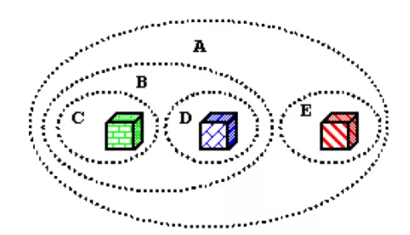

[Основные понятия]{.underline}: системное мышление, систематичность,
системность, управление вниманием, системные уровни, физическая
вложенность, понятия системного мышления, приемы мышления.

**Бытовое понимание**

Большинство людей оперирует «бытовым» пониманием терминов «система» или
«системное мышление» и подразумевает под «системностью» личную
организованность, старательность, желание всё предусмотреть, учесть
всевозможные детали и вообще всё, что угодно. Та «системность», которую
люди привносят в свою работу -- это может быть «продуманностью»,
дисциплинированностью в исполнении, следование какому-то плану.

Однако у особо старательных руководителей и сотрудников, для которых
абсолютно всё со всем связано, в результате такой «продуманности» планов
и дисциплинированности их выполнения, образуется ещё больший бардак в
головах и/или работа на корзину, а также постоянный аврал по всем
направлениям работы. «Системность» часто путают с «систематичностью» --
и систематически плохое или неправильное мышление приводит к плачевным
результатам.

Несмотря на то что многие словари определяют системность и
систематичность^[[https://ru.wiktionary.org/wiki/систематичность](https://ru.wiktionary.org/wiki/систематичность)]
как синонимы, мы будем разделять эти два понятия. Систематичность -- это
важное свойство по форме действий или мышления, а системность -- это
важное свойство по содержанию действий или мышления. Систематичность,
регулярность, дисциплинированность -- это когда человек постоянно, по
расписанию что-то делает, а вот что именно делает -- определяется
системностью. Системность -- это когда человек умеет своим вниманием
«разрезать» мир на разные системы, пользуется системными понятиями для
этого, умеет работать с этими системами и разными интересами.
Системность определяет, что именно делать, а систематичность означает,
что это делать нужно планомерно. Одно не заменяет другого. Необходимо
быть и системным, и систематичным.

Ещё одно бытовое заблуждение состоит в том, что под системностью
понимают обязательную связь всего со всем. И действительно, «взмах крыла
бабочки на одном континенте может вызвать землетрясение на
другом»^[[https://ru.wikipedia.org/wiki/Эффект\_бабочки](https://ru.wikipedia.org/wiki/Эффект_бабочки)].
Однако рассматривать все взаимосвязи сразу невозможно, человеку не
хватит вычислительной мощности мозга. Поэтому системное мышление
позволяет выделять разные интересы (точки
зрения)^[Сложность мира заключается не только в
технологиях или скорости изменений, а в наличии многочисленных интересов
и заинтересованных лиц. Технологии позволили быстрее формировать и
заявлять свои интересы в любой точке мира, в отличие от прошлых веков.
Поэтому повышается роль системного мышления как главного инструмента по
учету (удовлетворения) различных интересов при создании сложных
систем.] и работать с ними, чтобы они были учтены в
созданной системе.

Системность использует управление внимание, чтобы выделить в
рассматриваемой реальности важное. Например, может выделить системные
уровни, на которых существуют разные системы. Невозможно одновременно
рассматривать одновременно строение генома человека, клетки, органы,
мышцы и кости, части тела и поведение человека. Но можно рассматривать
каждый системный уровень, не теряя его связь со всей системой.
Системность означает, что необходимо думать о мире как о наборе
вложенных друг в друга матрёшек, причем в каждую матрёшку вложена не
одна, а несколько матрёшек.

Еще один пример с системными уровнями -- это «чемпионат страны по
футболу», который состоит из совокупности футбольных клубов, стадионов,
болельщиков, телетрансляций и т.п. На следующем системном уровне можно
рассматривать по отдельности, из чего состоят футбольные клубы.
Например, футбольные клубы состоят из команды футболистов, тренерского
штаба, тренировочных баз, детских школ и т.п. Соответствующим образом
можно выделить части стадионов, болельщиков, телетрансляции и т.п. На
следующих системных уровнях рассматриваем команду футбольного клуба. И
так далее.

Системные уровни определены не просто так, а по принципу физической
вложенности одних систем в другие. Постановка системного мышления
включает обязательно тренировку такого разделения мира на системные
уровни, системы и части систем (подсистем). Такое разделение условно и
производится вниманием. Многие теории тоже посредством внимания делят
мир, но по другим принципам, отличным от принципа физической
вложенности. Например, ножка стола физически входит (является частью) в
стол, но подмножество не входит в множество^[Стол и
ножка -- это объекты физического мира, а множество и подмножества -- это
понятия ментального пространства. Понятие «физическая вложенность»
относится только к объектам физического мира. Для ментальных понятий
тоже есть вложенности, но не физическая. Подробнее о разных отношениях
(например, классификация) объектов ментального пространства вы узнаете
на курсе «Рациональная работа».].

Научиться навыку выделения вниманием системных уровней просто из опыта,
без изучения понятий и моделей системного мышления, практически
невозможно. Или можно потратить годы для формирования опыта в одной
профессиональной сфере деятельности, но вряд ли он будет легко и быстро
перенесён в другую сферу деятельности^[Неосознанное
знание (без понимания системных уровней) об устройстве футбола не
гарантирует, что вы быстро разберетесь в строительстве.].
Хотя некоторые выдающиеся люди, которые долго работали с разными
системами или в разных сферах деятельности, могут неосознанно выработать
определенное мастерство, сходное по качеству с системным мышлением. Но
если осознанно учиться системному мышлению, то можно в несколько раз
сократить время на получение необходимого опыта и уменьшить стресс от
старта работ с чем-то новым.

В бытовом рассуждении системное мышление путается с наработкой большого
опыта или с получением хорошего технического университетского
образования. Все это, конечно, может помочь усилению интеллекта, но всё
же не загрузит в голову понятия и приемы системного мышления. В этой
связи, когда люди говорят слова «системность», «системный подход» или
«системное мышление», они с большой долей вероятности имеют в виду
систематичность, логичность, подконтрольность, большой опыт, хорошее
образование или желание показать, что они много думали, работали или
сделают всё правильно и хорошо^[Высшие и средние
менеджеры, политики и просто амбициозные специалисты пытаются
оперировать словами про системность, потому что так их речь выглядит
круче.]. Поэтому не путайте системность и
систематичность, а также обращайте внимание на слова людей, говорящих о
системе, и выясняйте, что стоит за словами (что они конкретно имели в
виду).

**Простое объяснение системного мышления**

Слова "системное мышление" можно отнести к названию курса, а также это
подтип общего мышления, который основывается на понятиях физики, теории
понятий, семантики, логики, онтологии, этики и других трансдисциплин.
Для того, чтобы развить такой тип мышления необходимо изучить и
применить к жизни (рабочим проектам) соответствующий курс "Системное
мышление", а начать можно с курса "Введение в системное мышление" (далее
курсы системного мышления).

Используя понятия разных трансдисциплин интеллект-стека, системное
мышление помогает моделировать мир и создавать успешные системы. Поэтому
можно сказать, что в курсах системного мышления собраны мыслительные
приемы, в которых используются понятия и принципы трансдисциплин
интеллект-стека.

В курсах системного мышление изучаются соответствующие понятия в связке
их между собой, а также приемы мышления. Приемы мышления --- это
способность увязать разные понятия между собой и найти физические
объекты в реальных проектах, которые каким-то образом связаны с этими
понятиями. Например, найти целевую систему и создателя, выделить связку
"роль-практика-рабочий продукт".

Возьмем, например, водопроводчика и прокурора. В чем суть мышления
водопроводчика и мышления прокурора? Большинство скажет, что они мыслят
определенными категориями или понятиями. У водопроводчика в голове
сантехника, ванная, трубы и тп, а у прокурора --- преступления,
приговор, суд и тп.

То есть мышление опирается на определенные понятия, которые необходимы
для того, чтобы выделять из мира важное для конкретных ролей. За счет
этих понятий удерживается внимание на тех объектах (физических или
ментальных), которые позволяют выработать гипотезу для последующих
действий. После этого мышление как бы заканчивается и далее происходит
действие (или бездействие).

Так вот, системное мышление --- это мышление, которое опирается не на
узкие ролевые понятия (прокурора и других), а на системные понятия.
Например, система, метод, роль, рабочий продукт и еще несколько десятков
системных понятий. Использование этих понятий позволяет связывать между
собой интересы многочисленных ролей, которые создают сложную систему, а
не только отвечают за свой узкий фронт работы. Или роли, на которые
как-то влияет система.

Чтобы стать прокурором или водопроводчиком необходимо учиться и работать
по профилю не один год, и точно также системное мышление развивается на
отдельных курсах, которые привязаны к реальным проектам. Просто так,
работая большим руководителем, системный язык не выучишь и приемы
системного мышления не освоишь. Требуется несколько месяцев и даже лет,
чтобы освоить системный язык и научиться его использовать по отношению к
сложным новым проблемам.

Но в чем плюс системного мышления, так это в том, что он универсален к
любым рабочим проектам и даже к личной жизни. Особенно он незаменим по
скорости получения результата, если речь идет о новом и неопределенном.
Вы можете за свою жизнь быстрее разбираться в законодательстве, в
информатизации, в дорожной деятельности, в транспорте, в связи, в
образовании за счет такого универсального мышления. Ведь, если знаешь
системный язык, то быстрее понимаешь как конкретно устроена любая
предметная область. И главное у вас получается навык проведения
системных изменений этой сферы деятельности.

Системное мышление -- это одинаковый подход к рабочим и личным проектам.
Везде осознанно выделяем целевые системы, системы создания, роли,
методы, рабочие продукты, архитектуру и еще несколько десятков системных
понятий, которые позволяют описывать сложные проблемы и находить лучшие
варианты их решения. А решением часто является создание успешных систем
(продуктов, сервисов), где успех -- это учет многочисленных
заинтересованных лиц.

Такой универсальный системный подход экономит время на переключение и на
обучение новому, поскольку всегда есть общее в создании ИТ-системы,
самолета или готового ко взрослой жизни ребенка.
