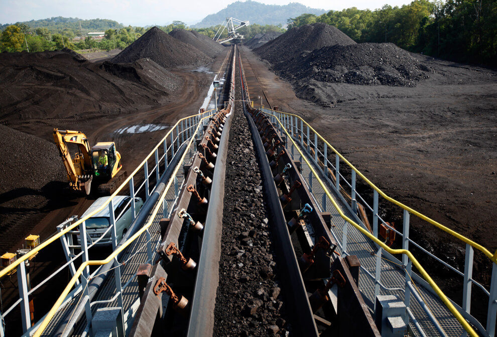

[Основные понятия:]{.underline} фокус внимания предпринимателя,
эксплуатация целевой системы, инновации, маркетолог, продажник,
визионер, бизнесмен, возможность/opportunity, оргспособность/capability

Любой проект начинается с определения, зачем он нужен и какие
потребности каких интересантов реализует. Обычно в проектах этим
занимаются предприниматели.

В фокусе внимания предпринимателя -- системный уровень «сообщество». Он
всегда в первую очередь смотрит за пределы/границы предприятия и думает
о том, как производимый предприятием продукт **используется в
реальности** (еще говорят «эксплуатируется в окружении»). Например, если
предприниматель продает автомобили, то он думает не об «автомобиле в
салоне», а об автомобиле, который везет груз или семью на дачу (ситуации
эксплуатации). Качество пошитого костюма оценивается не на манекене, а
на реальном клиенте в момент «выхода в свет» в этом костюме. Ленточный
конвейер для шахт интересует его не в момент продажи или перевозки -- а
в момент эксплуатации в шахте, когда везет руду на пару километров.

*Ленточный конвейер, везущий руду*

Почему это важно? Потому что клиенты платят за исполнение (системой)
каких-то функций. Если функция не исполняется, например, конвейер не
может довезти руду до точки назначения, то уже не так важно, какова была
его цена или насколько быстро его доставили. Поэтому предприниматель
всегда интересуется «(своей) системой в окружении других систем» (те
надсистемой по отношению к «своей» системе).

Но предпринимателя интересует не только «свой продукт» (или «своя
система») в окружении. Его интересует, как этот продукт *конкурирует* с
остальными. Насколько он хорошо выполняет свои функции? Для кого? А
какие другие опции есть у покупателей? Каково сообщество клиентов вообще
(Total Adressable Market)? Какая часть сообщества достижима для компании
-- сейчас и вообще? Как конкуренты реализуют свои продукты, как их
продукты удовлетворяют потребности покупателей? Как эволюционируют
конкуренты? Как меняется окружение, где работает продукт? Например, если
строим мост через реку -- какие здания строятся поблизости: жилые,
промышленные? Какие развязки дорожные появятся и как это повлияет на
пассажиропоток? Как изменится клиентура моста после этого? Какие другие
транспортные коридоры «конкурируют» за провоз товаров и людей?

В поисках хороших возможностей для получения прибыли предприниматели
меняют мир. Им приходится открывать новое: новые способы использовать
имеющиеся вещи, новые методы работы, дающие лучший результат. Например,
прибор, генерирующий микроволновые лучи, был создан для того, чтобы
получить более совершенные военные радары для обнаружения целей. Инженер
компании Raytheon заметил, что при контакте с лучами еда расплавляется
или разогревается. Компания Raytheon исследовала эту неожиданную функцию
приборов, а через год выпустила первую микроволновую печь. Возможность
извлечь прибыль из обнаруженной возможности отметили предприниматели в
компании.

Таким образом, предприниматели меняют мир, внедряя **инновации** в жизнь
окружающих. Ученые делают фундаментальные и прикладные открытия,
создавая теории, благодаря которым у инженеров появляется возможность
создавать новые вещи; инженеры создают их; а предприниматели --
распространяют. Поэтому предпринимательская деятельность -- это не
только деятельность по извлечению прибыли, но и по изменению мира.

Предприниматель -- составная роль, которая предполагает выполнение
целого набора функций. Поэтому в реальности удобнее говорить не о
«предпринимательских практиках», а практиках/методах каждой (под)роли
отдельно:

-   **Маркетологи и продажники** («прикладные разработчики»)
    осуществляют функцию привлечения (платящих) клиентов в компанию.
    Маркетологи фокусируются на привлечении неопределенного круга
    клиентов («клиентского сегмента»), а продажники -- на доведении
    конкретных привлеченных клиентов до покупок. Можно сказать, что
    маркетолог действует в формате «1-много», а продажник -- «1-1».
-   **Визионер** ищет возможность выгодно продавать какой-то
    **продукт/проект/сервис** (нашу/целевую систему). Сколько нужно
    денег, чтобы произвести продукт «сейчас» и продать его «потом»? По
    какой цене? Какому числу клиентов? Как долго можно продавать
    продукт? То есть, визионер оценивает прибыльность / выгодность
    продажи продукта клиентуре.
-   **Бизнесмен** ищет возможность выгодно продать **компанию**. Каков
    сейчас инвестиционный климат? На какие компании есть спрос? Какую
    компанию бизнесмен может создать? За сколько и когда он сможет ее
    продать инвесторам? То есть, бизнесмен оценивает прибыльность /
    выгодность продажи продукта инвеституре. И вот эту

Можно сказать, что визионер продает «молоко», а бизнесмен -- «корову»,
дающую молоко. Поэтому ключевой объект внимания у визионера и бизнесмена
будет различаться, хотя методы/практики в основе своей похожи.

Визионер выдвигает гипотезу, а точнее, целый набор предположений:

-   какой продукт купят и какой компания сможет произвести (что / what);
-   почему его купят и как компания сможет обыграть причины покупки в
    маркетинге (почему / why);
-   кто его купит и каким образом компания может получить доступ к
    сообществу клиентов (покупатели / who);
-   по какой цене продукт можно продать, чтобы компания получила прибыль
    c учетом издержек (цена / how much);
-   какие инновации в методах нужно использовать (how);
-   когда выходить на рынок, чтобы не прийти слишком рано или не
    опоздать (когда / when).

Визионеру нужно соединить «спрос» и «предложение». На что есть спрос на
рынке, какие **возможности/opportunities** по извлечению прибыли
существуют? А какие у компании организационные
**способности/capabilities** извлечь прибыль из конкретной выбранной
возможности? Нет ли разрыва между возможностями и способностями?
Например, маленький бизнес хочет продавать массовый товар, например,
бытовую химию дешево (бизнес-модель «много и дешево»). Но для того,
чтобы так продавать, обычно нужно больше ресурсов, чем есть у маленького
бизнеса. Поэтому может быть выгодно сместиться по спектру в сторону
бизнес-модели «мало и дорого», выбрав клиентский сегмент с наибольшей
болью и платежеспособностью.

**Бизнесмен** занимается тем же самым, только применительно к компании
как ключевому объекту внимания. Компания рассматривается как «товар» на
рынке инвесторов, точно так же оценивается, на какие компании сейчас
есть спрос (и мода), какие компании можно выгодно и быстро создать,
довести до выручки и продать. Или купить, увеличить прибыль либо
выручку, и перепродать -- есть целые инвестфонды, которые этим
занимаются.

Еще можно выделять **инвесторов** (инвестфонды), которые дают средства
на создание / развитие бизнеса. Часто в начале один и тот же человек
может исполнять роль инвестора, который ищет деньги для организации
бизнеса, бизнесмена, который создает компанию, и визионера, который
создает продукт. Но по мере развития бизнеса роли разделяются и начинают
исполняться разными людьми на разных должностях (например,
продакт-менеджеры занимаются развитием продукта).

На системной цепочке создания целевой системы, с которой вы
познакомитесь на других курсах, предпринимательская область интересов
выделена зеленым и отражает объекты внимания исполнителей ролей:

Когда начинается и заканчивается деятельность предпринимателей
(визионеров, бизнесменов, инвесторов)? Иногда есть представление о том,
что бизнесмен или визионер нужен лишь на запуске бизнеса, а потом может
«отойти от дел». С точки зрения системного развития проектов это миф:
если роли визионера, бизнесмена, инвестора перестают выполняться в
проекте, то он начинает медленно деградировать. Продукты, производимые
компанией, начинают не соответствовать изменившимся требованиям рынка;
сама компания действует устаревшими методами -- например, не применяет
современные автоматизированные системы учета (ERP, CRM, PLM и другие) и
тоже потихоньку устаревает морально. Поэтому нельзя говорить о том, что
роль можно прекратить выполнять. Нет, нужно продолжать следить за
рынком, выводить новые продукты и убирать старые, которые перестали
приносить выгоду, растить выручку компании, и так далее. Можно
попробовать делегировать часть функционала другим исполнителям -- но
сама роль должна выполняться, неважно кем. Все хорошее в социальном мире
создается, а не растет само по себе, нужна качественная инженерия.

В проекте обучения / постановки мастерства тоже можно говорить о личном
предпринимательстве. Взрослый человек, приобретающий образовательный
курс, выступает заказчиком обучения, который хочет получить от него
какую-то отдачу. Заказчиками или интересантами, которые могут быть
заинтересованы в эксплуатации соответствующего мастерства, могут
выступать и другие, например, работодатель, которому нужно, чтобы
сотрудники повысили производительность труда и лучше принимали решения.

Другими исполнителями внешних проектных ролей могут выступать члены
семьи, которые видят одного из своего круга более счастливым, поскольку
он начинает жить желаемой жизнью, более компетентным и способным
зарабатывать больше, вносить больший вклад в семью. Точно так же, как в
обычном коммерческом проекте, нужно думать о поиске ресурсов на обучение
(от денег до выделения достаточного времени на обучение и применение
изученного). И точно так же можно прикидывать отдачу от обучения.
