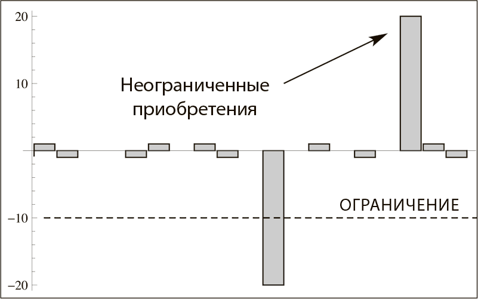
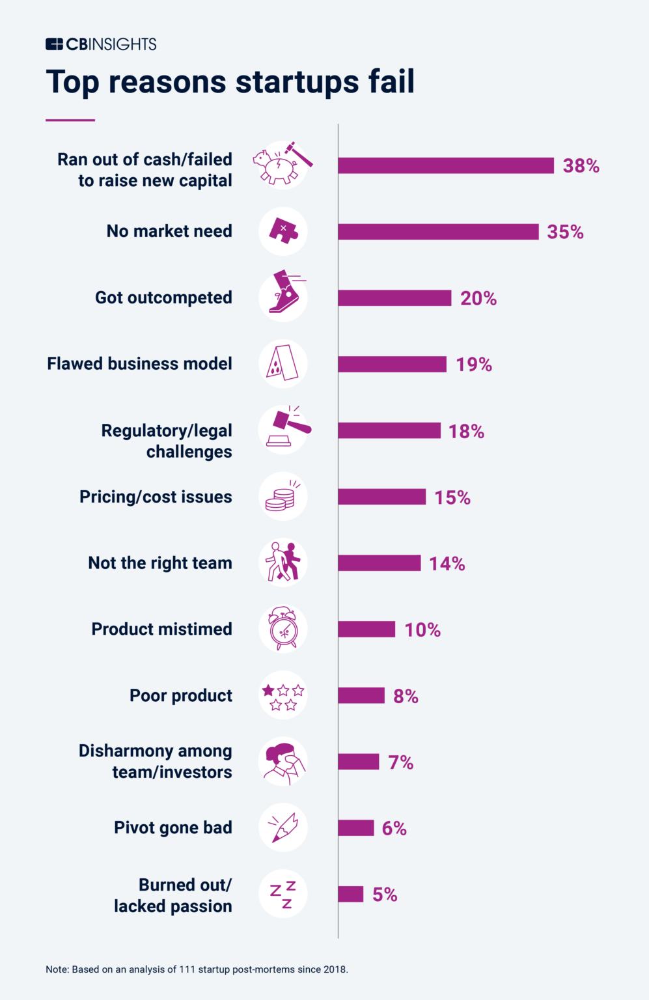
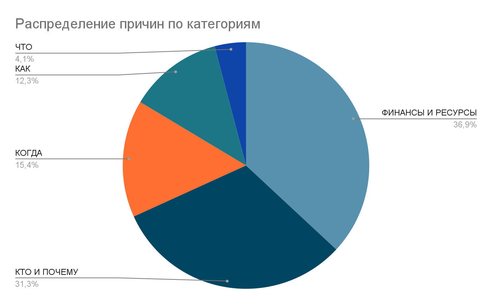

[Основные понятия:]{.underline} формула предпринимательского успеха,
принципы антихрупкости, удача, шкура на кону, ошибки предпринимателей

Если попробовать вывести «формулу» предпринимательского успеха, то
получим что-то вроде такого:

**Предпринимательский успех = мастерство х число повторений**

Чтобы получить предпринимательский успех, нужно иметь соответствующее
мастерство по запуску продуктов / бизнесов (или по инвестированию в
успешные бизнесы). Каким образом формируется мастерство?

Существует миф, что предпринимателями рождаются, а не становятся. Нужно
якобы иметь особые гены и особенные способности, а если не повезло
родиться без них, то бесполезно и начинать. К счастью, это всего лишь
миф.

Конечно, не существует никаких особых генов или особенного строения
черепа. Мастерство приобретается выучкой и (само)воспитанием. Чтобы
стать предпринимателем не только в отношении собственной жизни, нужно,
во-первых, усвоить определенный взгляд на мир. В частности, нужно
приобрести толерантность к неопределенности: предприниматель постоянно
действует в условиях, когда большинству ничего не ясно, будущее в тумане
и постоянно меняется, виражирует, и нужно быстро меняться вместе с ним.
Это очень некомфортно психологически для многих, и многие просто не
готовы согласиться жить в такой некомфортной для себя ментальной среде,
им это не нужно.

Кроме того, надо принимать конкуренцию и (желательно) любить
конкурировать. Конкуренция подталкивает предпринимателей к инновациям,
приводит к снижению цены и повышения качества для потребителей -- но
создает дополнительное давление на предпринимателей. Тоже не все
согласны жить с этим.

Можно ли «перековаться», если вот такой предпринимательский взгляд на
жизнь для вас сложен? Можно. Но это потребует времени, иногда
значительного -- времени, которое не будет инвестировано в улучшение
мастерства в других ролях, которые даются вам легче и лучше. Нужно ли
делать такой выбор? Этого никто не скажет, это выбор каждого. Что нужно
вам от жизни, определяете только вы сами.

Кроме взгляда на жизнь, нужно, конечно, уметь применять
предпринимательские методы/практики. Они даже важнее взгляда на жизнь.
Именно по результатам применения методов можно оценить, есть ли у вас
предпринимательский успех, достаточно ли ваше мастерство. Наличие
предпринимательского взгляда на жизнь может лишь облегчить ваш
предпринимательский путь, но не заменит применения методов.

К предпринимательским методам/практикам относят практики/методы создания
и тестирования MVP, проверку бизнес-моделей и финансовых моделей
продуктов и предприятий, оценку их выгодности, и так далее. Нужно
постоянно, в цикле, применять эти методы/практики, оттачивая
предпринимательское мастерство и допуская все меньше ошибок.

Предпринимательское мастерство повышает ваши шансы получить успех.
Однако одного его недостаточно! Иногда вы можете сделать все правильно,
принять хорошие решения, но вам просто не повезет. Кое-что об этом знает
тренер сборной Англии после поражения в финале Евро-2020. Решение
назначить игроков на серию пенальти не было плохим -- но стало
неудачным: зарешали опыт (мастерство) игроков сборной Италии в пенальти
плюс удача. Что же делать? Есть ли способ как-то «поймать удачу за
хвост»? Никаких гарантий, но можно попытаться!

Чтобы вам повезло, нужно предпринять много попыток, каждый раз оставляя
себе ресурсы на следующую попытку. То есть, следовать **принципам**
**антихрупкости, описанными** **Талебом**: ограничьте ваши потери и
выбирайте такие возможности, в которых потолок дохода не имеет явного
ограничения (потенциально возможны «иксы»), а потом пытайтесь
много-много раз. Тогда в какой-то момент вам *просто повезет*.

Впрочем, везение тоже нужно уметь использовать. И тут на помощь придет
мастерство: оно позволит *заметить* удачу и *использовать ее по
максимуму*. Вы сможете по существу оценить поступившее вам предложение,
и если оно потенциально приведет к серьезным потерям, а выхлоп небольшой
-- то вы откажетесь от него, а если принцип антихрупкости соблюдается,
то можно попробовать его принять.

Что еще, помимо антихрупкости и постановки «шкуры на кон» (= множества
попыток) нужно? Нужно ограничить потери. Но как это сделать? Тут можно
воспользоваться следующим приемом: выбрать ситуацию, в которой нужно
принять решение, и подумать, как точно, гарантированно принять *плохое*
решение. Как точно, гарантированно убить бизнес, сделать так, чтобы он
прогорел? Такое мы обычно представить и описать можем, можем перечислить
«точно плохие действия». Перечислили? А теперь переверните эти действия
-- и делайте наоборот!

Благодаря опросам исследовательских компаний и этому приему можно
описать ключевые ошибки предпринимателей на старте/запуске бизнеса.

Согласно данным CB
Insights^[<https://www.cbinsights.com/research/report/startup-failure-reasons-top/>],
есть 12 основных причин, почему проваливаются стартапы.

-   Закончились деньги, накопились долги, не смогли привлечь новый
    капитал \[кассовые разрывы\] -- 38%;
-   Нет рыночного спроса, потребности в продукте -- 35%;
-   Конкуренты победили (например, крупные конкуренты пришли и создали
    демпингующего конкурента) -- 20%;
-   Плохая бизнес-модель -- 19%;
-   Проблемы с законодательством (появилось регулирование, что повлияло
    на деятельность стартапа) -- 18%;
-   Проблемы с ценой и издержками -- 15%;
-   Плохо подобранная команда -- 14%;
-   Время выхода на рынок выбрано неверно (слишком рано или слишком
    поздно) -- 10%;
-   Плохой продукт -- 8%;
-   Проблемы \[с коммуникацией\] в команде и с инвесторами -- 7%;
-   Вираж / pivot прошел неудачно -- 10%;
-   У основателей пропала мотивация (ушла страсть, перестало быть
    интересно) -- 5%.

Обычно стартап убивает комбинация нескольких причин, а не
одна-единственная. Поэтому сумма процентов превышает 100% (195%).

Можно распределить причины по 5 категориям:

-   ФИНАНСЫ И РЕСУРСЫ (FINANCE & RESOURCE) -- у команды накопились
    финансовые проблемы: оказалось недостаточно ресурсов (в первую
    очередь финансов), чтобы дожить до превышения доходов над расходами;
    цены не покрывали расходы; плохая бизнес-модель, долги и кассовые
    разрывы.
-   КТО И ПОЧЕМУ (WHO & WHY) -- нет рыночного спроса на продукт (не
    нашли достаточного числа потребителей), плохо подобрали команду; не
    наладили общение в команде и с инвесторами; основателям это
    перестало быть интересно.
-   КОГДА (WHEN) -- время выхода на рынок. Слишком рано вышли и никто
    еще не готов использовать технологию (слишком сырая и дорогая),
    слишком поздно вышли и не смогут занять существенную долю;
-   КАК (HOW) -- проблемы с ведением бизнеса (законодательство);
    неудачно совершили вираж / pivot.
-   ЧТО (WHAT) -- продукт оказался недостаточно хорош.

Если распределить 12 причин по этим категориям и попробовать переоценить
процентное соотношение каждой причины (разделить ее частоту на сумму
процентов, например, 38/195 = 19,49%), то получаем следующую картину:

Как видно, реже всего стартапы умирают из-за того, что продукт оказался
не слишком качественным (ЧТО), возникли проблемы с законодательством или
виражированием (КАК). В сумме это только 16,4% причин.

Со средней частотой провал происходит из-за неверно выбранного времени:
слишком рано (еще не могут захватить рынок), слишком поздно (уже не
могут захватить рынок): 15,4% причин.

**Наиболее часто** стартапы проваливаются из-за недооценки ресурсов,
плохих ценообразования и бизнес-модели (ФИНАНСЫ И РЕСУРСЫ), а также
плохого выделения целевой аудитории (клиентов), плохого подбора команды,
некачественной коммуникации с командой и инвесторами (КТО И ПОЧЕМУ). Эти
две причины в сумме дают 68,21% причин провалов.

Поэтому, если вы хотите повысить свой шанс на успех, то нужно в первую
очередь тестировать бизнес-модель до того, как закончатся деньги и время
на попытки.

Кроме того, есть ошибки, которые можно допустить на каждой стадии
существования бизнеса. Например, можно считать, что ваш продукт и бизнес
абсолютно уникален, его нельзя сравнивать с остальными. У одного
американского маркетолога, который работал с самыми разными бизнесами,
висела табличка с самым частым возражением клиентов на его предложения:
'BUT MY BUSINESS IS DIFFERENT' («Но мой бизнес другой/уникальный»). Ему
говорили это очень часто; и так же часто после применения методов
маркетинга в новой отрасли оказывалось, что они работают. Почему так
происходило? Клиенты маркетолога не знали, что у всех объектов
класса/типа «бизнес» есть нечто общее, и самые общие методы маркетинга
не отличаются принципиально от отрасли к отрасли, хотя, безусловно, есть
своя специфика.

Другая ошибка -- считать, что все везде одинаковое. Конечно, методы
запуска и развития ларька с шаурмой и сети супермаркетов, веб-студии,
разрабатывающей игры, имеют свои отличия -- ту самую «отраслевую
специфику», которую надо учитывать.

Еще одна ошибка -- не учиться у лучших. Желательно искать удачный опыт
создания продуктов и бизнесов, который можно отмоделировать и применить.
Успешные визионеры и бизнесмены часто упоминают о том, что изучали чужой
опыт (успешный и не очень) и «воровали как художники», то есть,
использовали удачные методы и приемы, прошедшие проверку чужим опытом.

Конечно, ошибкой будет и не учитывать принципы антихрупкости, не растить
мастерство и не предпринимать достаточное число попыток.

Так что стать предпринимателем, научиться предпринимательскому
мастерству -- можно. Тем более что каждому из нас придется принимать
предпринимательские решения в отношении своей жизни: какую карьеру
строить, где жить, чему и как учиться.
